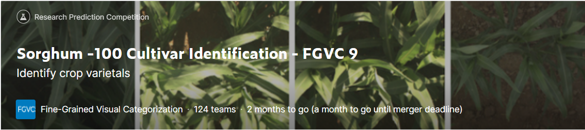
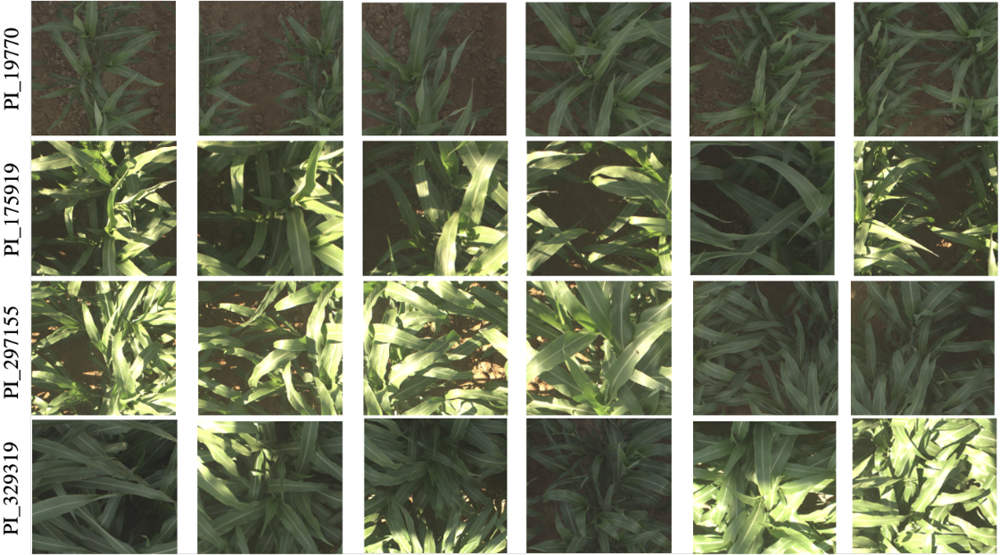

# Sorghum-100_Cultivar_Identification
Share the code for the competition of kaggle (https://www.kaggle.com/competitions/sorghum-id-fgvc-9)

## Overview
The Sorghum-100 dataset is a curated subset of the RGB imagery captured during the TERRA-REF experiments, labeled by cultivar. This data could be used to develop and assess a variety of plant phenotyping models which seek to answer questions relating to the presence or absence of desirable traits (e.g., "does this plant exhibit signs of water stress?"). In this contest, we focus on the question: "What cultivar is shown in this image?"

## Data Description
The Sorghum-100 dataset consists of 48,106 images and 100 different sorghum cultivars grown in June of 2017 (the images come from the middle of the growing season when the plants were quite large but not yet lodging -- or falling over).

Each image is taken using an RGB spectral camera taken from a vertical view of the sorghum plants in the TERRA-REF field in Arizona.